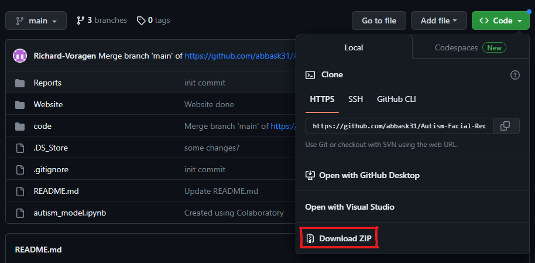
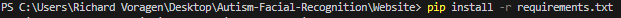
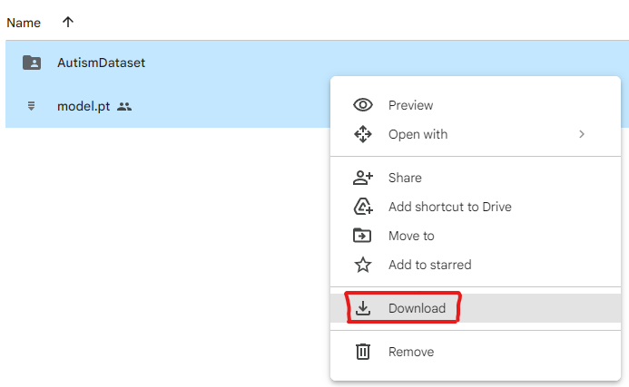
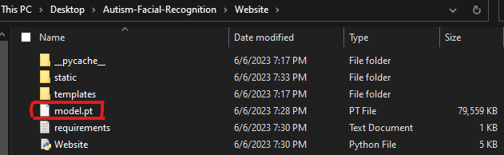
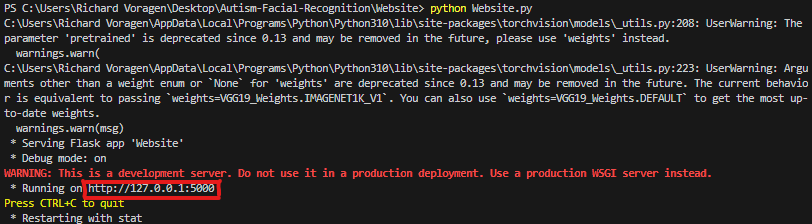

# Autism-Facial-Recognition
The Process to generate the model and website is time consuming so here are videos demonstrating them.  
[Video for the Website Demo](https://youtu.be/8JzHdWFlOtc)  

1. Download the entire Git repository and unzip it.

2. Navigate to the Website folder and run "pip install -r requirements.txt" to install all of the dependencies.

3. Navigate to this [LINK](https://drive.google.com/file/d/1lw2oQ0Z3xaS2AophmNpvUcRT12slhxwx/view) to download the model.pt.

4. Place the Model.pt file in the Website folder.

5. Run python Website.py and type the URL shown into any browser.

6. Drag any jpg image into the website dropbox and press upload to run the image through the model.
